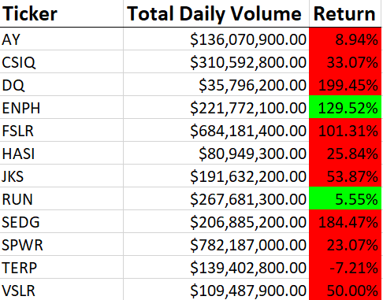
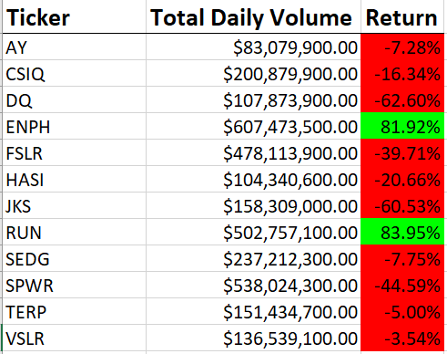

# stock-analysis
## Overview of Project: 
> The purpose of this analysis was to provide a tool for a client that wanted to compare the Daily Volume of stocks traded and calculate the Return for multiple stocks. I compared a list of 12 stocks from 2017 and 2018. 

## Results: 

> Using images and examples of your code, compare the stock performance between 2017 and 2018, as well as the execution times of the original script and the refactored script.

> Here were the results I analyzed in 2017:

> 

> Here were the results I analyzed in 2018:

> 

## Summary: 

> In a summary statement, address the following questions. What are the advantages or disadvantages of refactoring code? How do these pros and cons apply to refactoring the original VBA script?

> My stuff
