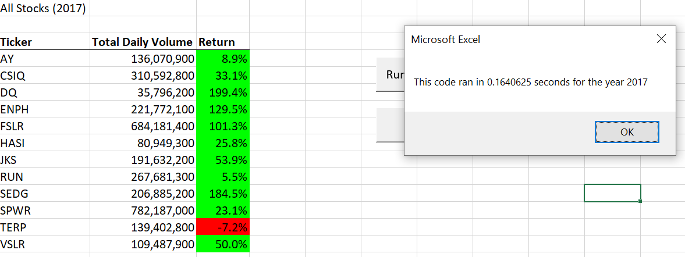

# stock-analysis
## Overview of Project: 
> The purpose of this analysis was to provide an interactive worksheet for a client that wanted to compare the Daily Volume of stocks traded and calculate the Return for multiple stocks. I developed a worksheet on Excel using VBA script to compare a list of 12 stocks from 2017 and 2018 to form conclusions of what would be the best stocks to invest in. 

## Results: 

> Based on the results given, it seems that ENPH and RUN would be two stocks that I would suggest to invest in as the Annual Return is positive from both 2017 and 2018. I was able to analyze this from the total data by creating macros that were able to search through data from each respective worksheet. I created for loops and applied conditionals to extract information from the data given to each respective year of the 12 stocks. I also created arrays when comparing the 12 stock options. One interesting thing I learned that was helpful was the use of concatenation and creating an input box in order to compare the 12 stocks based on the year you type in the input box. For the original VBA script code used for this, the code was able to calculate the Returns and Daily Volume but the run time was significantly longer than the refactored code. I also learned it is important to set make sure to set your variables to the right data type when writing or refactoring code.  

**Example of the code used for the InputBox is:**

```yearValue = InputBox("What year would you like to run the analysis on?)```

**An example of the concatenation code used is:**

```Range("A1").Value="All Stocks("+ yearValue +")"```

**To stay consistent throughout the code, I made sure that the right worksheet was activated by using the code:**

```Worksheets(yearValue).Activate```

 **Here were the results I analyzed in 2017 with the run time for refactored code included:**

> 

 **Here were the results I analyzed in 2018 with the run time for refactored code included:**

> 

I noticed that the refactored code is more 

## Summary: 

> Some advantages of refactoring code is to be able to analyze large amounts of data. However, the disadvantage that I noticed when refactoring the code is that sometimes you would have to debug any compile errors that kept arising as I was trying to run the code. Debugging code is difficult when you know the original code was working and running well. The pros and cons refactoring the VBA script for this analysis is that when I was trying to assign variables, to the refactored code, I would often run into compile errors or even at times missing closing loops or conditionals. I would like to learn how to avoid making any of these mistakes, but it seems that this is something that occurs often when refactoring code. 
