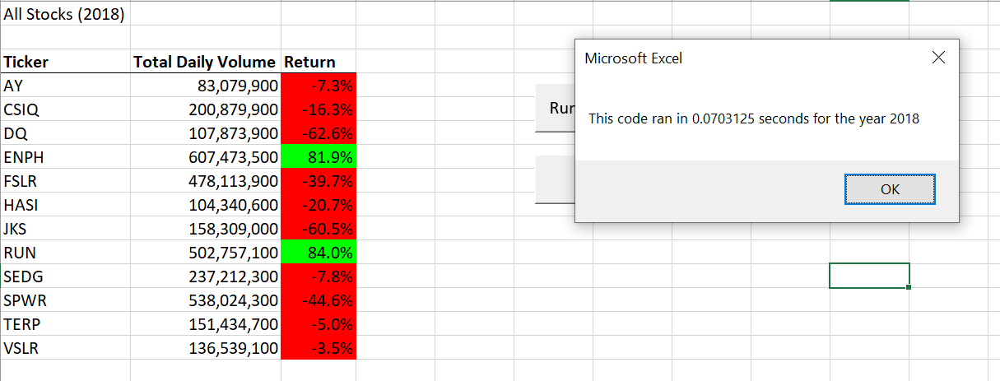

# stock-analysis
## Overview of Project: 
> The purpose of this analysis was to provide a tool for a client that wanted to compare the Daily Volume of stocks traded and calculate the Return for multiple stocks. I compared a list of 12 stocks from 2017 and 2018. 

## Results: 

> Using images and examples of your code, compare the stock performance between 2017 and 2018, as well as the execution times of the original script and the refactored script.

> Here were the results I analyzed in 2017:

> 

> Here were the results I analyzed in 2018:

> 

> Based on the results given, it seems that ENPH and RUN would be two stocks that I would suggest to invest in as the Annual Return is positive from both 2017 and 2018. I was able to analyze this from the total data by creating macros that were able to search through data from each respective worksheet. I created for loops and applied conditionals to extract information from the data given to each respective year of the 12 stocks. For the original VBA script code used for this, the code was able to calculate the Returns and Daily Volume but the run time was significantly longer than the refactored code. 

> Below are the run times of the refactored code which is significantly faster than the run time from the original code created for the analysis.
> 
> 

## Summary: 

> In a summary statement, address the following questions. What are the advantages or disadvantages of refactoring code? How do these pros and cons apply to refactoring the original VBA script?

> My stuff
